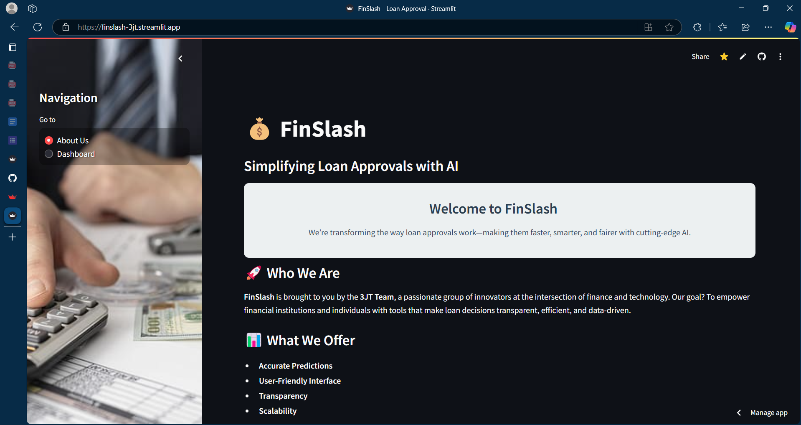
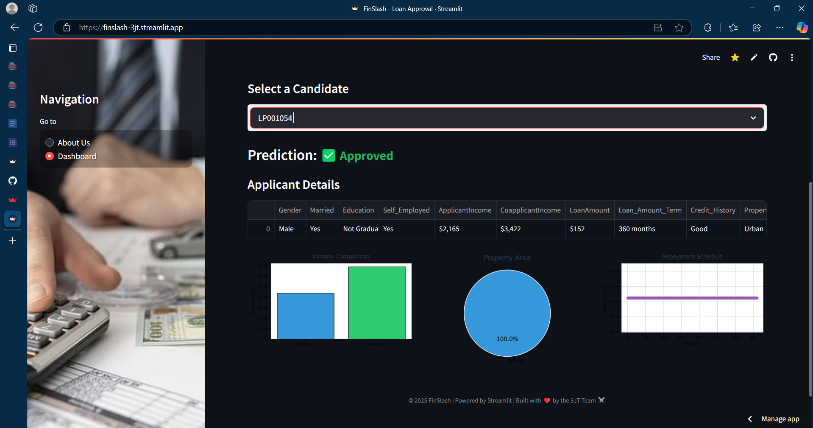

# FinSlash - AI-powered Loan Approval Dashboard

## 📋 Overview

FinSlash is an AI-driven loan approval dashboard that leverages machine learning to make loan decisions faster, smarter, and more transparent. Built by the 3JT Team, this application provides financial institutions with a user-friendly interface to analyze loan applicants and make data-driven approval decisions.

## 📸 Screenshots

### About Us Page


### Dashboard


## ✨ Features

- **AI-powered Loan Predictions**: Uses logistic regression to predict loan approval outcomes
- **Interactive Dashboard**: Visualize applicant data with comprehensive charts and graphs
- **Batch Processing**: Upload candidate CSV files for bulk prediction
- **Beautiful UI**: Clean, responsive design with intuitive navigation
- **Data Visualization**: Income comparison, property area analysis, and repayment schedules

## 🚀 Getting Started

### Prerequisites

- Python 3.7+
- pip

### Installation

1. Clone the repository:
   ```bash
   git clone https://github.com/AaryanGole26/FinSlash.git
   cd finslash
   ```

2. Install required packages:
   ```bash
   pip install -r requirements.txt
   ```

3. Run the application:
   ```bash
   streamlit run app.py
   ```

4. Open your browser and navigate to:
   ```
   http://localhost:8501
   ```

## 📊 Data Requirements

The application expects two CSV files:

1. `train.csv` - Used to train the model (already included)
2. `candidates.csv` - Contains applicant data for prediction (to be uploaded by user)

### CSV Format

Your `candidates.csv` file should include the following columns:

- Loan_ID
- Gender (Male/Female)
- Married (Yes/No)
- Dependents (0, 1, 2, 3+)
- Education (Graduate/Not Graduate)
- Self_Employed (Yes/No)
- ApplicantIncome
- CoapplicantIncome
- LoanAmount
- Loan_Amount_Term
- Credit_History (1.0 = good, 0.0 = bad)
- Property_Area (Urban/Semiurban/Rural)

## 💡 Usage

1. Navigate to the dashboard page
2. Upload your `candidates.csv` file
3. Select a loan applicant from the dropdown
4. View the prediction and detailed analysis
5. Explore the visualizations for deeper insights

## 🛠️ Technology Stack

- **Frontend**: Streamlit, HTML, CSS
- **Backend**: Python
- **Data Analysis**: Pandas
- **Visualization**: Matplotlib, Seaborn
- **Machine Learning**: Scikit-learn (Logistic Regression)

## 📝 License

This project is licensed under the MIT License - see the LICENSE file for details.

> "Lending made simple. Decisions made smart."
